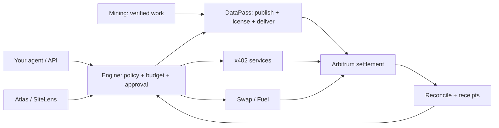

# Tools for agents that transact

Connect APIs, give agents a shared budget, and trace what they actually execute.
Economic Machine handles policy, approval, payment recovery and receipts. Your keys stay in your environment.

[Website](https://skew.deals) · [Console](https://skew.deals/commerce/console) ·
[Architecture](docs/ARCHITECTURE.md) · [C++ engine](native/README.md) ·
[Smart contracts](contracts/README.md) · [Self-host](docs/SELF_HOSTING.md)

## Source map

| Directory | Contents |
| --- | --- |
| [src/economic_machine](src/economic_machine/) | Typed state, ISA, compiler, invariants and deterministic runtime |
| [native](native/) | C++ kernel, financial primitives, search and sandboxed workers |
| [contracts](contracts/) | Solidity DataPass, commerce, mining and token contracts |
| [src/machine_engine](src/machine_engine/) | Accounts, shared budgets, agent policies and execution recovery |
| [src/machine_commerce](src/machine_commerce/) | Service discovery, payment adapters, licensing and delivery |
| [tests](tests/) / [cases](cases/) | Boundary tests, adversarial cases and typed example programs |
| [web](web/) / [site](site/) | Console and public tool interfaces |
| [docs](docs/) / [products](products/) | Architecture, integration references and tool guides |

Build outputs, operational records, private configuration and internal planning are
not part of the public toolkit. See [contributing](CONTRIBUTING.md).

## Choose a tool

| | Tool | Purpose |
| --- | --- | --- |
|  | **[Engine](products/engine/README.md)** | Shared budgets, typed programs, approvals and durable execution records. |
|  | **[Atlas](products/atlas/README.md)** | Source-linked APAC public compute-price observations. |
|  | **[DataPass](products/datapass/README.md)** | Versioned data licenses, wallet entitlement checks and delivery. |
|  | **[Mining](products/mining/README.md)** | Verifiable work, publishable artifacts and bounded SKEW issuance. |
|  | **[Swap / Fuel](products/fuel/README.md)** | Wallet-approved USDC → native ETH with settlement tracking. |
|  | **[SiteLens](products/sitelens/README.md)** | Power-to-GPU capacity scenarios with explicit assumptions. |

Each tool has its own source map and usage guide. They share one runtime and console;
the product directories are entry points, not six separately published Python packages.

## Run Engine

Python 3.11+; Linux is recommended for the native tools. Run from a source checkout:

```sh
git clone https://github.com/skew-labs/economic-machine.git
cd economic-machine
python3 -m venv .venv
.venv/bin/pip install -e .
umask 077
export ENGINE_ADMIN_TOKEN="$(.venv/bin/python -c 'import secrets; print(secrets.token_urlsafe(48))')"
.venv/bin/economic-machine serve --db runtime/engine.sqlite3 --port 8800
```

Open `http://127.0.0.1:8800/engine` and unlock it with that token. Keep the checkout:
the console currently loads web assets from the repository. This is a local owner
installation; hosted multi-user commerce needs its own authentication and merchant configuration.

## Build the C++ tools

CMake 3.20+, a C++20 compiler and threads are required. No model or wallet is needed.

```sh
cmake -S native -B build/native -DCMAKE_BUILD_TYPE=Release
cmake --build build/native --parallel 2
ctest --test-dir build/native --output-on-failure
```

Builds the kernel, financial primitives, route-search and solution-search libraries.
Linux additionally builds the sandboxed worker pipeline. Native outputs are candidates;
they do not authorize signatures or transactions.

## How it fits



Source availability is not a deployment or audit claim. Signing, live order transmission,
merchant admission and mining deployment are separate operator-controlled steps. Unknown payment
outcomes retain their budget reservation until reconciled. See [security boundaries](SECURITY.md).

Software is [MIT licensed](LICENSE). Data rights and third-party marks have separate terms;
see [NOTICE](NOTICE.md). [SKEW brand downloads](https://skew.deals/commerce/brand.html).
