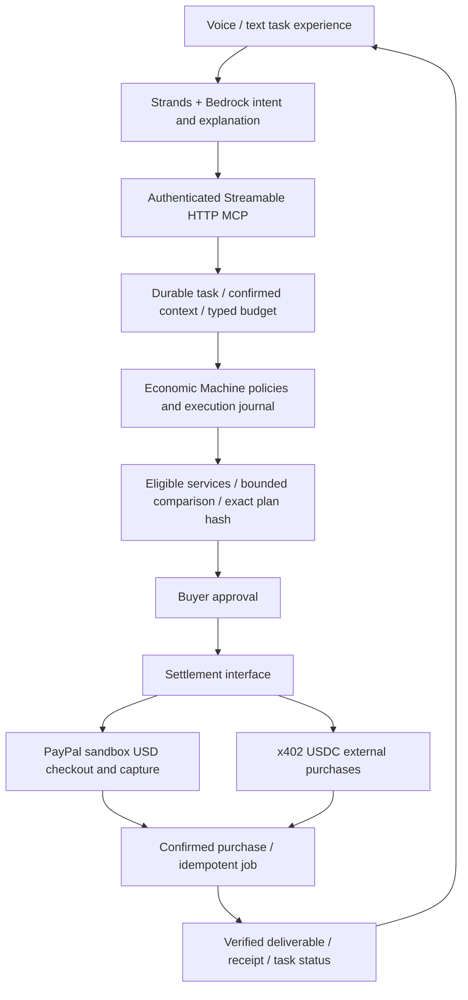

# SKEW Tasks — Amazon and PayPal extension plan

Status updated 2026-10-04: PR1 task foundation and PR2 checkout code exist.
The original PR3–PR5 implementation is now in GitHub PR13–PR15; PR6 packaging
and deployment evidence is in GitHub PR16. Mainnet token preparation is PR12.
Code completion is distinct from live acceptance: AWS Bedrock is blocked by an
explicit organization SCP denial; PayPal sandbox seller/buyer configuration,
actual payment receipts, public video URLs and contest submission readback are
still required. See `submission/AMAZON.md`, `submission/PAYPAL.md` and
`AMAZON_PR5_EXPERIENCE.md` for exact implemented scope and evidence.

## Product and first customer outcome

SKEW Tasks lets a person delegate a finished task under a price ceiling, approve
the exact purchase, and return later to the result and receipt. The existing
console remains its operational view; tasks and commerce share its workspace.

Practical first scenarios: compare CRM or logistics vendors, prepare a sourced
competitor brief, draft a customer proposal, clean a CRM import, or localize a
product catalog. GPU pricing is one optional specialization, not the task system.

Example: “Compare three CRM vendors for our procurement meeting under $10,
using the same confirmed criteria and regions as last time.” In PR1 the user
explicitly supplies typed conditions; language interpretation is PR5. PR1 saves
briefs and their revisions, not completed comparisons or paid deliveries.

Remember region/report preferences and explicitly confirmed conditions. Retrieve
the previous completed report as context. Find eligible report options, show two
plans with dated sources and an exact price, request approval, execute the paid
job, and deliver a report plus receipt. A later “Is it ready?” resolves the same
persisted task across sessions. A follow-up can request a revision under a newly
approved budget. Remembered preferences never create spending authority.

The first PayPal seller is our own admitted report service. Sell our produced
analysis and licensed deliverables; do not represent public source archives as
exclusive licensed feeds or pretend to have onboarded independent vendors.
Atlas snapshot and generated comparison report are two service options from one
merchant, not two independent sellers. Add genuine PayPal-enabled sellers after
their merchant identities, terms and delivery APIs are provisioned.

## Shared architecture

Strands orchestrates discovery, drafting and explanation through allowlisted
typed tools. Bedrock is an optional intent/explanation provider for the Amazon
build; preserve the existing Qwen provider interface. Neither model receives
signing keys, edits economic constraints nor becomes the continuous payment loop.
Native C++ handles applicable numerical statistics and deterministic predicates;
report prose still requires a language model. Do not claim every task is native.

Proposed MCP tools: `create_task`, `get_confirmed_preferences`, `compare_plans`,
`request_purchase_approval`, `get_task_status`, `get_deliverable`, `request_cancel`.
The MCP client cannot treat its own tool invocation as buyer payment approval.
Owner scopes, consent and plan version are checked inside the engine. No arbitrary
shell, URL, merchant, SDK tool discovery or secret-bearing memory is admitted.

PayPal USD cents, existing USDC atoms and exchange USDT turnover stay separate.
There is no automatic PayPal-to-USDC conversion or double charge for one sale.
An owned report service can use already provisioned compute as its fulfillment
cost; an external x402 purchase still needs its own authorized USDC budget. Exact
buyer price and internal cost exposure are different accounting boundaries.

## Contest-facing integrations

| Technology | Actual product responsibility | Demonstration evidence required |
| --- | --- | --- |
| Alexa+ style experience | Multi-turn delegation, confirmed memory, resumption and result cards | Clearly labeled working web simulation; actual Alexa/device access only if later granted |
| MCP 2025-11-25 Streamable HTTP | Reusable scoped interface to the same task/commerce kernel | Protocol negotiation, tool discovery/calls, cross-owner rejection and runtime trace |
| AWS Strands + Bedrock | Bounded intent drafting and multi-step tool orchestration | Actual model response, actual tools used, usage/cost and task correlation ID |
| PayPal Orders v2 + Checkout | Buyer-approved USD purchase, capture, status and refund path | Actual sandbox order/capture IDs and API readback, not a simulated PayPal button |
| Verified PayPal webhooks | Asynchronous payment reconciliation | Verification, duplicate/out-of-order handling, matching API readback and one entitlement |
| Existing C++ and durable kernel | Constraints, reservations, allowed transitions and replay | Reused native/ledger evidence and focused adapter integration tests |

Additional AWS components are optional milestones: AgentCore Memory for consented
semantic preferences; an encrypted S3 backup destination for operational recovery.
Structured authority stays in our own ledger. Neither AWS deployment nor S3
disaster recovery is claimed until configured and exercised. Do not introduce
more services solely to display sponsor logos.

## Six implementation PRs

| PR | Scope | Acceptance |
| --- | --- | --- |
| 1 | Durable task schema, typed USD price ceiling, confirmed preferences, practical work templates and versioned service SKU registry | Cross-session brief resume; five work types; ambiguous USD amounts rejected; confirmed preferences cannot authorize spending |
| 2 | PayPal sandbox adapter, scoped checkout UI, capture/readback and entitlement | Real sandbox approve → capture completed → one entitlement → report download; exact payee/currency/amount match |
| 3 | Signed webhook admission, crash recovery, cancellation and refund state | Duplicate webhook/click cannot double-deliver; unknown capture retains hold and is queried; paid cancellation is a refund request, not fictitious unpaid cancellation |
| 4 | Authenticated Streamable HTTP MCP server and typed task tools | Version negotiation and real runtime calls; agent cannot approve its own payment or read another owner's report |
| 5 | Strands/Bedrock provider, voice/text task view, plan cards and resumption | Actual model/tool trace; two valid options; one human approval; pause/resume; finished report shown with sources and receipt |
| 6 | Two English demo builds, cost/latency comparison and submission packages | Amazon experience film; PayPal sandbox completion film; reproducible setup, contribution links, change-window evidence and friction log |

PRs 2–3 require a privately configured PayPal sandbox merchant application and
buyer account. PR 5 requires authorized AWS model access and a bounded spend
configuration. No live PayPal charge, AWS account creation, contest registration
or third-party account sharing is implied by this plan. Build/test/evidence remain
on the authorized Canadian host; Mac remains source/control only.

## Payment and job correctness

Persist request identifiers and submission intent before side effects. Use
PayPal-Request-Id for supported mutating endpoints within the endpoint's documented
retention window. Bind IDs to an operation and input hash. On an uncertain capture,
query canonical order/capture state; do not create a fresh order or charge again.
An approval redirect or order APPROVED is not completed capture. Verify merchant,
environment, amount/currency, owner linkage and capture status before fulfillment.

Verify webhook authenticity and then reconcile via the PayPal API; never accept a
caller-posted “paid” event. Give fulfillment an idempotent purchase/job identifier.
Capture success with missing output retains a delivery-missing state. A retryable
job must not imply retryable payment. Stop remaining work on cancellation, retain
completed costs, and reconcile any separately admitted refund. Sandbox completion
is evidence of integration, not a live customer purchase.

## Demo and measurements

Amazon demo: speak the report request → recall confirmed regions → compare two
cards → exact price and buyer approval → navigate away → ask status in another
session → see/read the finished report. Clearly identify an Alexa+ simulation.

PayPal demo: same intent → suitable report offer → actual sandbox approval →
capture readback → access grant → output download and receipt. Then replay an
approval/webhook and interrupt fulfillment; show one charge and resumable delivery.
Demonstrate cancellation/refund separately with its real sandbox status.

Compare the same task with manually connecting the same services. Record time,
user interactions, repeated configuration, discovery requests, actual model usage,
charged total, fulfillment completion, duplicate captures and recovery time.
Use comparable inputs, prices, cache state and failure schedules. Define completion
as completed capture plus verified deliverable. Publish failures and measurement
scope; assert improvement only after results. Do not manufacture token savings by
comparing our bounded engine with an intentionally wasteful baseline.

## Dates and submission boundaries

Amazon closes October 23, 2026 at 12:00 PDT: October 24 at 04:00 KST.
Prioritize the Alexa+ primary track, with AWS Builder and Open Source as optional
mini-challenge targets. A project can win one primary-track and one mini-challenge
prize; do not promise both mini-challenge awards. Alexa+ private preview tools are
not generally accessible. The rules permit a clearly demonstrated simulation.
The MCP implementation path requires at least specification 2025-11-25 over
Streamable HTTP. Existing work needs substantial changes within the contest window.

PayPal closes November 12, 2026 at 12:00 PST: November 13 at 05:00 KST.
Target the overall competition and Agentic Commerce consideration; the rules limit
which grand/mention/sponsor awards can be combined. PayPal sandbox and AI must be
central, with a working build and public open-source repository. Existing work
needs substantial changes after October 1; preserve baseline and contribution URLs.
Prepare separate English descriptions and under-three-minute videos. Actual
registration/submission and successful receipt are separate tasks, not accomplished
by adding an adapter or publishing this plan.

## Official references

- [Amazon rules](https://amazonappdev2026.devpost.com/rules)
- [Amazon FAQ and preview-access boundary](https://amazonappdev2026.devpost.com/details/faqs)
- [PayPal rules](https://paypalaihackathon.devpost.com/rules)
- [PayPal official announcement](https://developer.paypal.com/community/blog/PayPal_AI_Hackathon/)
- [Strands MCP tools](https://strandsagents.com/docs/user-guide/sdk/tools/mcp-tools/)
- [PayPal Orders integration](https://developer.paypal.com/api/rest/integration/orders-api)
- [PayPal request identifiers](https://developer.paypal.com/api/make-api-requests)
- [PayPal webhook verification](https://developer.paypal.com/api/rest/webhooks/rest/)
