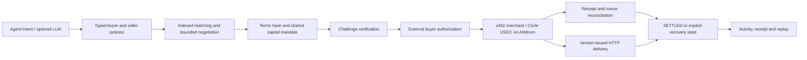

# Arbitrum submission — Economic Machine + Machine Mining

Updated 2026-10-04. New vertical: requester-funded useful-work tasks and verifiable token rewards, integrated into the existing owner console and C++ runtime. This extends the data/service commerce app; it does not relabel earlier x402 transfers as mining rewards.

## Solution Mining research extension

The same Mining console now has a Solution research mode: 32-node weighted Max-Cut, 16 problems per round, sender-bound commit/reveal, Solidity score replay, fixed research-token issuance caps and a bounded next-round difficulty controller. The public UI runs C++ candidate searches only. No public research-token issuance or live VRF subscription is enabled.

The remote attack suite deliberately demonstrates a remaining admission weakness: 64 wallets can fill one problem’s commitment slots. This does not increase issuance, but it prevents claiming production-ready mining. CPU algorithm and local-EVM verification-cost comparisons are recorded; GPU and paid AI comparisons have not run. See [Solution Mining](SOLUTION_MINING.md) for the exact research scope and open gates. Existing public settlement evidence must not be relabeled as emission/mining activity.

## Machine Mining demonstration

1. Open `/commerce/console#mining`, authenticate and freeze a work request.
2. Search a fixed pool snapshot with C++, review the selected path and download the exact receipt.
3. A local participant can submit its own agent's path, independently verify it and seal it without uploading API keys or reveal secrets.
4. The new Solidity contract implements funded job creation, sender-bound commit/reveal, exact integer verification, commitment-order ties, bond recovery and pull reward withdrawal.
5. New-contract public deployment and a public funded job remain pending owner authorization. The current demo shows owner drafts/native computation; the escrow lifecycle is verified using actual compiled bytecode in remote Py-EVM.

Existing independently observed deployment: SkewDataPass on Arbitrum Sepolia at `0x2C9619Cd327418571963A3334EA674FA1F4Fb234`, deployment transaction `0x6edc6f928c7e48aabdf8b1140eaa024ddd1e02084ea8e3278fdc597808160bc8`. Its deployment proof is `artifacts/arbitrum-sepolia/datapass-deployment.json`; it records no DataPass purchase and no mining reward.

A complete new mining demonstration needs a source-verified public contract, requester reward escrow, two participant commitments/reveals, finalization and exact reward withdrawal reconciled by two RPCs. The new offline deployment review is `artifacts/mining/deployment-review.json`. Never call an unsigned request, a local EVM receipt or an old test-USDC transfer a public mining transaction. After that evidence, record the demo video and submit the project through the registered HackQuest account; retain the actual submission receipt.

Detailed verifier/CLI/limits: [Machine Mining](MACHINE_MINING.md).

## Earlier commerce submission materials (historical)

# Economic Machine — Arbitrum Open House Singapore

**Draft submission packet, checked 2026-10-02. This document is not a HackQuest submission receipt.**

## Project summary

Economic Machine is a shared execution layer for agents buying and selling data or services.
An agent registers typed buying or selling conditions once. The engine discovers compatible suppliers,
negotiates within price and usage limits, admits spending against a shared mandate, and tracks x402
authorization, settlement, delivery and recovery. Routine commerce does not require a language-model loop.
People manage wallet identity, API keys, spending limits and transaction records through the console.

Data and service agents otherwise repeat supplier discovery, pricing, freshness, licensing and payment
handling across each integration. Economic Machine makes those conditions interoperable and reusable.
GPU/RAM availability and pricing feeds are a proposed first vertical. The demonstrated public-chain sale
is an Arbitrum finalized-block snapshot, not a GPU purchase, a compute lease or a financial product.

## Judge links

| Evidence | Link |
| --- | --- |
| Public product and supplier-policy comparison | [Economic Machine](https://machine.148-113-153-116.nip.io/commerce/) |
| Separate accounts / agents / activity Engine | [Engine](https://machine.148-113-153-116.nip.io/commerce/engine) |
| MIT-licensed source, portable kernel and self-hosting | [GitHub](https://github.com/skew-labs/economic-machine) |
| Joined purchase record and interactive policy replay | [Completed trade](https://machine.148-113-153-116.nip.io/commerce/submission) |
| Machine-readable runtime, signature and delivery evidence | [Trade bundle](https://machine.148-113-153-116.nip.io/commerce/demo/trade) |
| Exact delivered data | [Delivered JSON](https://machine.148-113-153-116.nip.io/commerce/demo/trade/artifact) |
| API keys / funds / activity, recorded read-only workspace | [Console preview](https://machine.148-113-153-116.nip.io/commerce/console?preview=1) |
| Public settlement | [Arbitrum Sepolia transaction](https://sepolia.arbiscan.io/tx/0x3aa1cbbb04e18c0a1d07b3c9cc92b255bc7a3bdb6b62080fa1fb933659b11758) |

The separate native Site retains owner-only access. Use the public HTTPS links above for judge access.
The owner reports that participation registration is complete. Source is published separately from
private runtime state. An uploaded demo video and the final HackQuest submission receipt are still required
before claiming that a complete submission has been delivered.

## What the actual purchase proves

1. The buyer registered a 0.01 test-USDC budget, one snapshot, internal-research usage and freshness limits.
   The seller registered a 0.0125 ask, 20% rule discount and immutable version `block-314868529`.
   Deterministic negotiation produced the 0.01 agreement without LLM inference.
2. The engine admitted an x402 v2 challenge tied to that agreement, resource and shared payment mandate.
3. An external operator CLI signed the disposable buyer's exact EIP-712/EIP-3009 authorization.
   The runtime itself held no buyer wallet key. The seller paid test ETH to execute the authorization.
4. Circle test USDC executed `transferWithAuthorization` on Arbitrum Sepolia, chain ID 421614.
   The exact 10,000-atom transfer and authorization-used event appear in successful receipt block 314873781.
5. The seller's HTTP delivery contained the same terms hash and data version as the agreed purchase.
   Its artifact hash is `384cb6a7784d847e88c849e93c8831fa1d3b62fe46784dae14482360aefefc24`.
6. The runtime reconciled chain confirmation and delivery before marking the payment `SETTLED`:
   10,000 atoms spent, zero reserved. The buyer went from 20 to 19.99 test USDC; the seller received 0.01.
7. The new read-only evidence builder recovered the buyer signature from the actual transaction calldata
   through two RPCs. The reconstructed x402 payload hash equals the runtime's stored submission hash.
   It also joined payment, mandate, demand, seller rule, terms, received artifact and transition journal.
   This ties the observed transfer to the application's purchase, rather than using an unrelated transfer.

The interactive page evaluates changed budget, freshness or license conditions at the **original purchase
time**. It is a historical replay, not a second purchase or a current quote. Tight budget, stale data and
ungranted commercial rights each reject the offer without requesting a signature or payment.

## Arbitrum deployment and assurance

| Component / requirement | Current evidence |
| --- | --- |
| Existing project participation | Allowed by the official event page |
| Arbitrum Sepolia | Explicitly named as an accepted chain by the official event page |
| Application services | Hosted engine, portal and separate test merchant; real HTTP purchase flow |
| Contract used by this purchase | Existing Circle test USDC `0x75faf114eafb1BDbe2F0316DF893fd58CE46AA4d` |
| Project-owned contract deployment | **SkewDataPass publicly deployed**; see the 2026-10-04 update above. `MachineCommerceEscrow.sol` remains local-EVM tested; new `MachineMining.sol` public deployment is pending. |
| Buyer signing | Actual disposable buyer EIP-3009 signature through external CLI; browser wallet login is a separate capability |
| Browser checkout | **Not demonstrated**; the console manages identity, keys, limits and records |
| Fresh chain audit | Two distinct RPCs reconfirm canonical receipt, exact logs, consumed nonce, signature and delivered block fields |
| Historical balances | Preserved earlier successful two-RPC audit; these are not fresh balance reads, as a public RPC pruned historical account state |
| Delivery assurance | Received HTTP artifact bound to agreed terms/version; public block data independently matches |
| Atomic delivery/payment | **Not provided** by this x402 flow; paid-but-missing-delivery recovery keeps that state explicit |
| Registration | Complete according to the owner; final project submission remains separate |
| Eligibility and final submission | Organizer determination and HackQuest submission receipt remain unconfirmed |

The official wording requires the project to be deployed on an Arbitrum chain and judges smart-contract
quality. It does not certify this implementation's eligibility. Executing an existing USDC contract
does not by itself prove a project-owned deployment. Do not describe an unused escrow deployment or a
token transfer as a completed end-to-end project deployment.

Official reference: [Arbitrum Open House Singapore: Online Buildathon](https://www.hackquest.io/hackathons/Arbitrum-Open-House-Singapore-Online-Buildathon).
The published submission end is October 4, 2026 at 15:59 UTC, corresponding to **October 5 at 00:59 KST**.

## Measured product value

- Controlled warm-path HTTP comparison: 24 engine trade requests versus 192 cached-direct requests,
  an 87.5% reduction. Both achieved 18/24 valid agreements. Registration adds 65 setup requests; the
  cached-direct client was faster for the first full 24-trade workload including setup.
- Actual Kiln Qwen3-32B loop comparison: 122,242 versus 417 startup-inclusive provider tokens,
  a 99.66% reduction; 10/24 versus 24/24 completed feasible trades in that fixed workload.
  Cached deterministic code also achieved 24/24 with 417 tokens. This is evidence against the measured
  repeated-model loop, not a universal advantage over all direct integrations or customer conversion.
- Public-chain evidence: one isolated 0.01 test-USDC agent purchase. It demonstrates integration and
  reconciliation, not mainnet safety, customer adoption, general merchant availability or commercial data rights.

Methodology and original evidence: [HTTP comparison](COMPARISON.md), [Qwen study](QWEN_COMPARISON.md),
[public purchase](ARBITRUM_SEPOLIA.md). None of those unchanged studies was rerun for this packet.

## Architecture

The LLM has no routine payment authority. Price, quantity, asset, freshness, purpose, license, expiry and
budget are checked in code. An ambiguous submission retains capital and is not blindly retransmitted.
Local journal hashing checks recorded integrity; it does not prove external truth or replace chain consensus.

## Remaining submission work

1. Record the walkthrough in [ARBITRUM_DEMO_SCRIPT.md](ARBITRUM_DEMO_SCRIPT.md), clearly identifying
   the recorded public purchase and external CLI signing.
2. Enter the published source-repository URL and an uploaded demo video in HackQuest. Private credentials,
   production databases, wallet keys and private configuration are excluded from the public repository.
3. Resolve the organizer's deployment interpretation or complete a separately reviewed, genuinely used
   project-contract path. Any new signing or chain transaction needs its own explicit authorization.
4. Submit through the authenticated owner account and retain the actual HackQuest submission receipt.

The public page and this packet substantiate settlement and delivery. They do not establish that these
four remaining steps have already happened.
