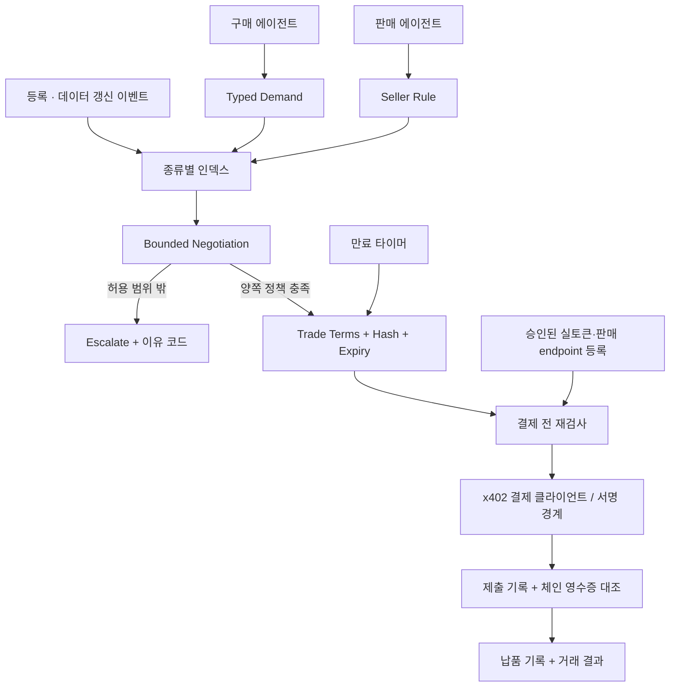

# 양쪽 정책을 연결하는 Economic Machine

LLM은 사용자의 애매한 의도를 정책으로 바꾸거나, 규칙으로 해결되지 않은 조건을 검토합니다.
평상시 발견·협상·거래 상태 처리에는 참여하지 않습니다.

`P` 이후는 아직 외부 서비스와 연결하지 않았습니다. 현재 마켓은 합의와 결제 전 차단까지 실행됩니다.
별도의 예제 서비스 주문 경로는 테스트 크레딧으로 전체 상태 전이를 실행합니다.

## 정책과 실행 의미론

`Demand`: 데이터 종류, 목적, 사용권, 수량, 단가 상한, 총액 상한, 최신성, 갱신 간격, 응답 기한, 정책 TTL.

`SellerRule`: 데이터 종류/버전, 제안 단가, 최저 단가, 수량 할인, 수량 범위, 허용 목적/사용권,
업데이트 시점, 갱신 간격, 응답 시간, 정책 TTL.

제안 가격과 수량 할인을 계산하고 최저 가격으로 제한한 뒤 구매자의 단가/총액 상한과 대조합니다.
목적/사용권/수량/최신성/갱신/응답 조건은 모두 충족해야 합니다. 조건을 임의로 완화하지 않습니다.
현재 협상은 제한된 한 번의 역제안이며 전략적인 다회차 협상·경매가 아닙니다.

`TradeTerms`: 두 참여자와 정책 ID, 데이터 버전/업데이트 시점, 목적/사용권, 수량, 단가/총액,
자산, 갱신/응답 조건. canonical JSON과 SHA-256으로 묶습니다. 사용자 지갑 서명은 아직 없습니다.

합의 유효기간은 두 정책 TTL과 데이터 최신성 한도 중 가장 이른 시점입니다.
새 버전은 기존 합의를 무효화합니다. 같은 버전을 다시 알리는 것은 최신성을 연장하지 않습니다.

상태는 `AGREED`와 `ESCALATE`, 결제 전 검사에서 `BLOCKED`입니다.
예제 주문은 `RESERVED → FULFILLING → DELIVERED → VERIFIED → SETTLED`, 실패는 `REFUNDED`입니다.

## 불변조건

- 예제 구매의 예약액·지급액·잔액 합은 초기 테스트 잔액과 일치합니다.
- 같은 주문 키의 같은 요청은 같은 결과를 돌려줍니다. 다른 요청으로 키를 재사용하면 거절합니다.
- 공급자의 최저 단가, 구매자의 총예산, 목적·사용권 조건을 넘지 않습니다.
- 데이터 버전이 바뀌거나 최신성이 만료된 합의는 결제에 사용할 수 없습니다.
- 요청자가 구매자이며 조건 해시가 현재 합의와 같아야 결제 검사에 진입합니다.
- 판매자 최저가·할인 내부 규칙은 공개 공급 목록에 표시하지 않습니다.
- 합의만으로 잔액을 예약하거나 지급하지 않습니다.
- 서명, 제출 보고, 정산 보고, 체인 검증, 납품은 서로 다른 사실입니다.

## x402와 에스크로의 관계

공식 v2 규격에서 HTTP `PAYMENT-REQUIRED`는 base64 JSON이며, 결제 방식·네트워크·atomic amount·
자산·수령인·타임아웃을 담습니다. 우리 라이브러리는 승인된 바인딩과 일치하는 하나의 exact EVM
EIP-3009 요구만 통과시킵니다. EIP-712 토큰 이름/버전도 비교합니다.

일반 x402 결제에 이 프로젝트의 납품 검증·환불 의미론이 자동으로 포함되는 것은 아닙니다.
`MachineCommerceEscrow`는 별도로 선택하는 보호 거래 경로입니다. 사용자 지정 verifier에 의존하며
데이터의 진실을 수학적으로 증명하지 않습니다. 수수료 토큰·rebasing 토큰 등은 지원하지 않습니다.

규격: [x402 v2](https://github.com/x402-foundation/x402/blob/main/specs/x402-specification-v2.md),
[HTTP transport](https://github.com/x402-foundation/x402/blob/main/specs/transports-v2/http.md).

## 운영 경계와 확장

현재 인증 주체는 서버가 발급한 24시간 테스트 세션입니다. 지갑 신원·서명된 정책·복수 조직 권한은 미구현입니다.
사람은 영어 콘솔의 API keys / Funds & limits / Activity에서 권한과 자본을 관리합니다.
구매·판매 조건 등록·매칭·협상·실행은 에이전트 API가 담당하며 사람용 마켓 양식을 주 경로로 제공하지 않습니다.
소유자만 제한된 에이전트 키를 발급·회수하고 지출 정책을 만들 수 있습니다. 키는 SHA-256 해시로 저장합니다.
주문 실행 키는 하나의 소유자 정책에 묶이며 다른 정책의 주문 생성·실행·취소가 거절됩니다.
여러 키가 같은 정책을 사용하면 예약액·지출액이 같은 예산을 소비합니다. 키 회수는 이후 호출을 막으며
진행 중인 주문의 환불이나 이미 정산된 대금의 취소를 뜻하지 않습니다. 권한 검사 전에 승인된 작업을 소급 취소하지 않습니다.
판매 선언은 입력 조건으로 비교할 뿐 데이터 내용/법적 사용권을 보증하지 않습니다.

수요 등록은 해당 수요와 같은 종류의 활성 공급만 비교합니다. 공급 등록/갱신은 해당 공급과
같은 종류의 활성 수요만 비교합니다. 기존 수요와 공급 사이의 조합은 다시 계산하지 않습니다.
한 종류에 많은 참여자가 몰리면 이벤트당 fan-out이 커지므로 가격·사용권·최신성 인덱스,
fan-out 상한, 큐·구독 스트림이 필요합니다. 현재 수량 범위는 주문별 범위이며 재고 예약은 미구현입니다.
서버는 15초마다 만료 이벤트를 기록합니다. 클라이언트 push 알림과 외부 에이전트 callback은 미구현입니다.
서버의 해시 저널은 변경 탐지용이며 외부 앵커가 없는 관리자 공격까지 막는 증명은 아닙니다.

서비스는 단일 프로세스·SQLite·localhost로 실행합니다. 기록 전체의 무결성 검사는 작은 마켓 기준입니다.
공개 고객 서비스에는 대규모 인덱스, 신원, rate limit, 입력 스트리밍 상한, 감사/재해복구, 지원 프로세스가 필요합니다.
