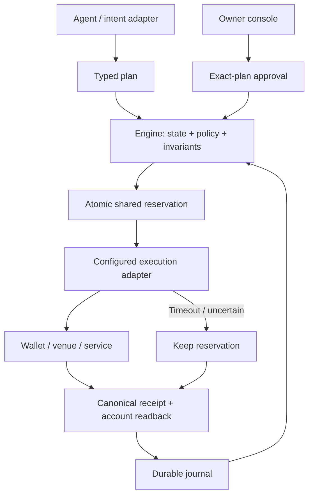
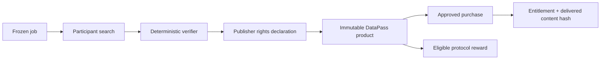

# Architecture

SKEW is a shared execution layer for agents that purchase services, trade licensed data and
produce verifiable work. Economic Machine is the runtime; the console is its owner-facing interface.

## Responsibility map

| Layer | Owns | Does not own |
| --- | --- | --- |
| Agent / intent adapter | Interpret a request, propose a typed plan | Wallet authority or financial truth |
| Engine | Typed state, policies, shared reservations, allowed transitions, receipts | Private keys or external finality |
| Atlas / SiteLens | Source-linked observations and explicit capacity scenarios | Cloud inventory guarantees |
| DataPass | Version identity, license rules, entitlement and delivery checks | Legal certification of upstream data |
| Mining | Frozen jobs, deterministic scoring, bounded reward rules | Guaranteed commercial value or profit |
| Swap / Fuel | Exact quotes and orders, gas acquisition, recovery | Free gas or arbitrary cross-chain routing |
| External signer / chain / venue | Owner signature, external execution and settlement | Automatically satisfying off-chain delivery |

## State and authority

1. Observations carry source, sequence and time. Old or incompatible state cannot silently become fresh.
2. The compiler checks typed programs before registration. The kernel evaluates transitions and invariants.
3. C++ or model outputs are candidates. A candidate does not gain permission to execute.
4. The engine reserves capital before dispatch so competing agents cannot independently spend it.
5. Owner approval binds the plan, amount, recipient, network and expiry accepted by the adapter.
6. Submission uncertainty is persisted before external calls. Recovery follows the original operation.
7. Settlement and delivery are separate states. A transaction hash alone is not completion.

Known transitions do not call a language model. Conversation providers sit outside the deterministic
loop and may propose plans or explain state; a model cannot change the kernel's invariants.

## Data products and work

`SkewArtifactMining` requires winning work and a matching publication for token eligibility.
It does not require a later customer purchase. The separate requester-funded and VRF research
protocols use different reward semantics. A rights declaration is an accountable assertion, not
an oracle of legal ownership.

DataPass and x402 are distinct payment rails. Access must not be billed through both for the same sale.
Atlas can supply a report to a publisher, but a report hash grants no additional data rights.

## Arbitrum deployment boundaries

The [Arbitrum One manifest](../contracts/deployments/arbitrum-one.json) identifies the deployed
DataPass, ArtifactMining and SKEW contracts, created by one launch bundle. Contract deployment,
product registration, a paid license and delivered bytes are separate observable states.
The native DataPass route uses exact native-USDC allowance and a version-bound purchase;
the x402 route uses a separately bound EIP-3009 authorization. Neither route needs a second
copy of the escrow or research-mining contracts.

`deploy/datapass-mainnet.conf` binds both the public portal and authenticated runtime to the
same mainnet contract and bytecode. Apply it after other DataPass environment overrides.
`MACHINE_PUBLIC_CHECKOUT_NETWORK` restricts new commerce checkouts and payment preparation;
historical Sepolia profiles remain available for original-payment reconciliation. Browser
purchase journals are scoped to the chain, contract and buyer. Old receipts retain their
original network and explorer.

A publisher reviews the content, license, seller, USDC price and sale period before wallet
submission. Both RPC providers must confirm absence before a registration plan is prepared.
After an ambiguous submission the UI only allows reconciliation, not another submission.
The separate VRF research protocol and test payment tokens are not the SKEW production rail.

## Native execution boundary

The C++20 libraries use bounded input structs, checked arithmetic and fixed-capacity queues.
Python binds to a configured library hash. Linux's worker pipeline separates search and validation
and applies a process sandbox; provider and signing credentials remain outside the worker.
The public CMake entry point builds libraries and conformance programs, with assertions retained
in Release configurations. It does not claim kernel-bypass networking or end-to-end exchange latency.

## Source map

- [Kernel and ISA](ENGINE_ARCHITECTURE.md): `src/economic_machine/`.
- [Self-hosting](SELF_HOSTING.md): `src/machine_engine/`, `web/`.
- [Financial primitives](ECONOMIC_PRIMITIVES.md): `native/include/machine/economics/`.
- [Commerce](SERVICE_COMMERCE.md): `src/machine_commerce/`.
- [Tool guides](../products/README.md): code, contracts and entry points for each tool.
- [Security](../SECURITY.md): trust and signing boundaries.

Operate from a source checkout. Keep runtime databases, signer material, raw licensed inputs and
operator configuration outside version control. Recorded inputs under `tests/fixtures/` are
explicit test data; they never confer live authority. Generated compiler output and operational
reports belong in the ignored `artifacts/` directory.
