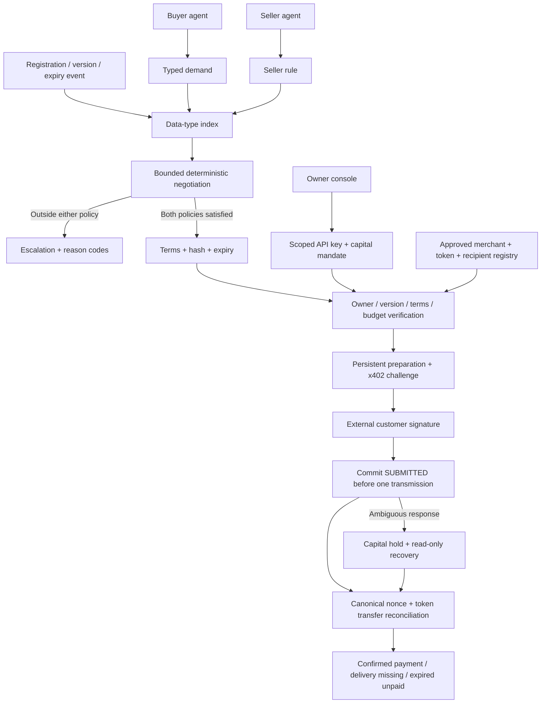

# Economic Machine for bilateral agent commerce

The engine executes policies shared by buying and selling agents. LLMs can draft typed policies and handle
exceptions. The observation, matching, bounded negotiation, capital and settlement loops do not call an LLM.

All boxes have runtime implementations except the external customer signer/merchant/facilitator themselves.
Those external systems must be independently provisioned. They are fixtures in the current EVM tests.
The active private service has no approved real resource registry and remains in development mode.

## Semantics

Demand and seller rules describe payment asset, price and quantity bounds, freshness, refresh cadence,
response deadline, purpose and license. Negotiation is one bounded offer/counter/accept path, not an auction
or a strategic multi-round bargaining model. It never relaxes either participant's constraints.

TradeTerms include both owners/policy IDs, data version, quantities, prices, usage conditions and explicit asset.
Canonical JSON/SHA-256 binds them for admission. A version change invalidates earlier agreements; replaying
an unchanged version does not extend its freshness. Agreement expiry is the minimum of policy/freshness bounds.
`AGREED` means accepted economic conditions, not delivered data or a paid transaction.

Demand registration returns its current agreements inside the same exclusive database transaction. Supply
registration/refresh compares only the affected supply against same-type demands. No full cross-product replay.
Each side/data type admits at most 100 active policies. Current inventory limits are per request, not globally reserved stock.

Real payment mandates and the test-credit ledger are separate. Real assets require an explicit CAIP-19 identity
and an operator-approved merchant/token/recipient binding. A TEST_CREDIT agreement cannot become a real payment.
Each payment-enabled key binds to one mandate; reservation and confirmed spending share that mandate's budget.

`PREPARED → CHALLENGE_READY → SUBMITTED → SETTLEMENT_REPORTED/UNKNOWN → SETTLED`.
Alternative outcomes include `PAID_DELIVERY_MISSING`, `EXPIRED_UNPAID`, and never-transmitted `CANCELLED`.
No phase substitutes for another: merchant reporting is not chain proof; payment is not data-quality assurance.
The default x402 path cannot automatically refund a paid bad delivery. Separate escrow is an optional,
undeployed contract path and is not silently inserted into an x402 transaction.

## Invariants and authority

- Demand/supply agree on asset, price, quantity and usage constraints before payment admission.
- The buyer owns the agreement and presents its current terms hash; current seller data version must match.
- Only an owner creates credentials and mandates. Agents cannot raise their own limits.
- Reservation plus confirmed spending never exceeds mandate budget; payment idempotency prevents re-preparation.
- Platform signing authority is absent. Only a valid external payer signature reaches the approved merchant.
- SUBMITTED commits before transmitting a bearer authorization; subsequent submit calls never resend it.
- Ambiguity retains capital. Finalized unused-nonce evidence after expiration is required to release an uncertain unpaid hold.
- Successful canonical receipt, exact AuthorizationUsed and exact Transfer are required to confirm spending.
- Delivery remains missing if terms/version payload verification fails, even when the payment succeeded.
- Production has authenticated provisioned owners, HTTPS cookies and persistent throttles; no seeded test funds or test orders.
- Exact registered HTTPS URLs only; public DNS pinning, preserved certificate hostname, no redirects, bounded bodies/timeouts.

The 15-second recovery worker performs chain reads, not signing or payment retransmission. Stale/unknown
outcomes are observable through payment records and degraded worker health. See [Production](PRODUCTION.md)
for the detailed HTTP contract, supported token/signature types, limits and operation gates.

## Storage and assurance

The service uses one process, SQLite WAL and BEGIN IMMEDIATE mutations. A hash journal is verified once
per exclusive transaction before appends, without cross-transaction caching. The journal is local corruption
detection; it has no external anchor against privileged database rewriting. RPC finality relies on an approved
provider's finalized tag and canonical readback, not an independently proved parent-chain finality claim.

Public customer rollout still requires real merchant integration, customer-authorized signing, approved live
payment, backup/restore, alerting, operational review and independent security review. Multi-region failover,
public signup/OIDC, push subscriptions, inventory reservations and large-market throughput remain outside this release.

Sources: [x402 v2](https://github.com/x402-foundation/x402/blob/main/specs/x402-specification-v2.md),
[exact EVM](https://github.com/x402-foundation/x402/blob/main/specs/schemes/exact/scheme_exact_evm.md),
[EIP-3009](https://eips.ethereum.org/EIPS/eip-3009).
