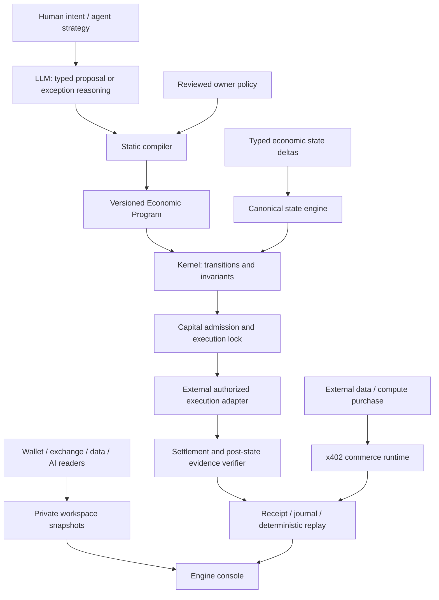

# Economic Machine Engine

The product has two entry points: an agent API and a user-owned console. The console reads a local
operations view; it does not turn every market observation into a language-model prompt.

`E` and `V` are explicit interfaces in the portable kernel. Concrete adapters own external
execution and verification. The commerce runtime connects payment authorization, settlement
and delivery; a recorded example remains separate from an authenticated account.
The kernel is chain-independent; the supplied chain integrations target Arbitrum.

## Execution semantics

Economic Programs use a pinned ISA, fixed-point strings, static phase checks and bounded control flow.
The kernel returns an awaiting-authorization intent or an explicit abort/escalation. The durable runtime
handles dependency-driven wakes, deduplication, expiry, revisions, capital reservations and locked
execution. Pausing prevents local new execution paths while retaining ambiguous external encumbrance.
Replay checks both content identity and the journal. Unknown state opens an outbox item; bounded model
assessment can propose a program but cannot register it or grant authority by itself.

The connection layer preserves asset units and observed times. It does not manufacture a global USD
portfolio or synthesize price/state evidence from a wallet read. Connector refresh runs outside a database
write transaction; a disconnect advances the generation and rejects an in-flight stale commit. Failed
refresh preserves the prior snapshot with degraded/stale status. No network request runs merely because
a connection is registered.

## Product pages

- **Overview:** native-unit balances, agent budgets, real imported orders and recent receipts.
- **Connections:** credential references, allowed reader operations, refresh status and disconnect.
- **Agents & limits:** reviewed Economic Program, capital/exposure/cost limits, allowed venues, evaluate,
  pause and resume. Execution requires an external authorization and evidence path.
- **Activity:** deterministic evaluations, reason codes, imported open orders, receipt inspection and replay.
- **API usage:** idempotent adapter reports, token counters and integer micro-USD costs. Not provider billing.

The hosted showcase exposes only selected public evidence from a completed disposable-wallet testnet
purchase. Self-hosting retains private account state in the user's own SQLite store. Neither mode routes
a user's exchange API trades through the commerce payment network.

## Current boundaries

Wallet readers: native ETH and configured USDC on supported Arbitrum networks. Exchange readers: Binance Spot balances/open
orders and USD-M derivative balances, positions and orders. Data reader: bounded JSON fingerprint.
AI reader: model catalog with no inference side effect. Durable, lease-based read scheduling and
venue order recovery run server-side. Hosted wallet identities own separate private workspaces.

The unified console and first live-capable order adapter are described in
[UNIFIED_ENGINE.md](UNIFIED_ENGINE.md). Spot LIMIT and one-way reduce-only USD-M LIMIT compile to
hash-bound owner-approved plans. Transmission requires the operator gate in addition to
owner approval. These venue primitives do not provide new leveraged positions, generic
withdrawals or provider invoice reconciliation. Wallet signing is an external adapter boundary.
