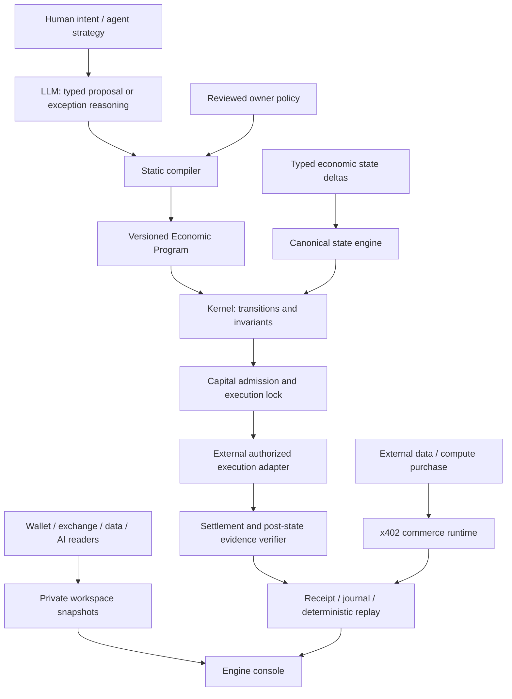

# Economic Machine Engine

The product has two entry points: an agent API and a user-owned console. The console reads a local
operations view; it does not turn every market observation into a language-model prompt.

`E` and `V` are explicit interfaces in the portable kernel. This release does not install a live generic
exchange executor or wallet signer. The separate commerce runtime has a completed public-testnet x402
path; its recorded authorization, settlement and delivery are joined in the public Engine view.
The kernel is chain-independent. Arbitrum is the currently demonstrated external settlement network.

## Execution semantics

Economic Programs use a pinned ISA, fixed-point strings, static phase checks and bounded control flow.
The kernel returns an awaiting-authorization intent or an explicit abort/escalation. The durable runtime
handles dependency-driven wakes, deduplication, expiry, revisions, capital reservations and locked
execution. Pausing prevents local new execution paths while retaining ambiguous external encumbrance.
Replay checks both content identity and the journal. Unknown state opens an outbox item; bounded model
assessment can propose a program but cannot register it or grant authority by itself.

The connection layer preserves asset units and observed times. It does not manufacture a global USD
portfolio or synthesize price/state evidence from a wallet read. Connector refresh runs outside a database
write transaction; a disconnect advances the generation and rejects an in-flight stale commit. Failed
refresh preserves the prior snapshot with degraded/stale status. No network request runs merely because
a connection is registered.

## Product pages

- **Overview:** native-unit balances, agent budgets, real imported orders and recent receipts.
- **Connections:** credential references, allowed reader operations, refresh status and disconnect.
- **Agents & limits:** reviewed Economic Program, capital/exposure/cost limits, allowed venues, evaluate,
  pause and resume. Execution requires an external authorization and evidence path.
- **Activity:** deterministic evaluations, reason codes, imported open orders, receipt inspection and replay.
- **API usage:** idempotent adapter reports, token counters and integer micro-USD costs. Not provider billing.

The hosted showcase exposes only selected public evidence from a completed disposable-wallet testnet
purchase. Self-hosting retains private account state in the user's own SQLite store. Neither mode routes
a user's exchange API trades through the commerce payment network.

## Current boundaries

Wallet reader: Arbitrum Sepolia ETH and Circle test USDC. Exchange reader: Binance Spot balances/open
orders. Data reader: bounded JSON fingerprint. AI reader: model catalog, with no inference side effect.
Derivative position readers, automated feed scheduling, generic financial dispatch, provider invoice
imports, multi-tenant administration and a new browser-signed purchase are not implemented in this
standalone release. Extend one capability with an explicit contract and verification evidence at a time.
