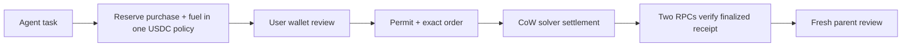

# SKEW Fuel

Fuel turns a missing native-gas balance into a bounded, wallet-approved engine
step. Arbitrum users holding native USDC can request native ETH without first
sending an approval transaction. A CoW solver pays the settlement transaction's
gas and recovers its costs through the quote. SKEW does not supply free gas,
hold customer keys, or operate the CoW solver network.

Public entry: https://skew.deals/commerce/console#overview

## Product flow

1. Connect an Arbitrum One wallet and enter a positive USDC amount (six decimal places; default 2).
2. Read balances, permit nonce and contract domains through two pinned RPCs.
3. Review an indicative route, then sign a ten-minute EIP-2612 USDC permit for
   exactly the selected amount to the existing CoW vault relayer.
4. Simulate the permit with `eth_call` and request a verified solver quote.
5. Review the native-ETH floor and sign the exact CoW order. This second signature
   authorizes the swap and submits it; it is not a login signature.
6. Record submission uncertainty before contacting the order book. Reconcile the
   same order after timeouts or restarts. Never automatically place a replacement.
7. Read the settlement receipt, canonical/finalized block, matching order event,
   and recipient balance from two RPCs before recording `FILLED_FINALIZED`.

Only chain 42161, native USDC and native ETH are admitted. USDC.e, arbitrary
tokens, cross-chain swaps and arbitrary routers are not supported. Wallets must
produce an EOA-compatible EIP-712 signature; EIP-1271 contract-wallet signatures
are not implemented. An EIP-7702 wallet still needs a compatible owner signature
and a passing route simulation; its settings alone do not establish compatibility.

## Engine integration



An owner connects `arbitrum-one-wallet`, creates an active engine control policy
and agent, then creates a Fuel policy. `POST /api/engine/fuel/policies` accepts:

```json
{
  "owner": "<public Arbitrum wallet address>",
  "budget_atoms": 10000000,
  "max_fuel_atoms": 2000000,
  "max_purchase_atoms": 8000000,
  "agent_ids": ["<registered agent id>"],
  "expires_at": 0
}
```

Replace `expires_at` with a Unix timestamp between 10 minutes and one day ahead.
One USDC is 1,000,000 atoms. There is no fixed dollar cap. The owner sets the policy budget and per-action limits; wallet inventory and existing reservations must cover them. Engine policy amounts use exact safe JSON integers (at most 2^53-1 atoms); direct quote amounts are decimal strings within uint256. Signed orders expire within ten minutes. Every permit covers only the reviewed amount.

A hosted engine API key with `engine:write` can propose:

```json
{
  "request_id": "my-task-fuel-1",
  "policy_id": "<Fuel policy id>",
  "agent_id": "<registered agent id>",
  "parent_action_hash": "<64 lowercase hex characters binding the intended task>",
  "purchase_atoms": 1000000,
  "fuel_atoms": 2000000,
  "required_eth_wei": 500000000000000
}
```

Send this to `POST /api/engine/fuel/requests`. In the hosted product, prefix API
paths with `/commerce`. The response contains `wallet_review_url`, opening the
same Fuel screen with the task and shared reservation attached. The owner signs
in to the same wallet/chain workspace, reviews the two financial signatures, and
decides whether to proceed. Scoped API keys cannot submit these signatures, edit
policies, cancel a parent hold or authorize a parent action.

| Route suffix on `/api/engine/fuel/requests/{id}` | Authority | Effect |
| --- | --- | --- |
| GET request | engine:read / owner | Read the bound request |
| `/order` | owner + permit signature | Simulate permit, fix exact order |
| `/submit` | owner + order signature | Durable intent submission |
| `/reconcile` | engine:write / owner | Verify and charge fuel once |
| `/resume-review` | owner | Fresh balance + parent hash + one-use review barrier |
| `/cancel-parent` | owner | Release an unhanded parent reservation |

The ledger reserves purchase plus fuel atomically across competing agents. A
wallet inventory check also includes parent holds under other Fuel policies.
Policy and wallet connectivity are rechecked inside the signature-submission
transaction. Pausing prevents new submissions but does not cancel a signed order
already accepted by CoW; its reservation remains until settlement or expiry proof.

`resume-review` does **not** execute the original task. It retains the parent
purchase reservation and requires a fresh simulation and separate approval.
Generic parent-adapter settlement/charge handoff is not yet implemented. A local
self-hosted owner's API can use these routes; local agent-bound keys still only
support their existing agent-run routes, not direct Fuel requests. Hosted scoped
keys support Fuel proposals and reconciliation.

## Checks and trust boundaries

- Exact recipient is always the permit owner. Browser and backend reconstruct
  signed domains, fields, amount, hooks and order UID independently.
- Maximum routing fee: 0.1 USDC; protocol fee: 100 bps; order slippage: 50 bps.
- The reviewed minimum must be within 5% of fresh Chainlink ETH/USD and USDC/USD
  reference prices, including fees. Both RPCs must agree within 0.5%. This is an
  independent off-chain sanity check, not an on-chain oracle guarantee.
- Chain state must be at most 120 seconds old, ETH/USD at most one hour old,
  USDC/USD at most one day old. A down/uninitialized sequencer or the first hour
  after recovery blocks quotes. Failures do not trigger a weaker fallback.
- A fulfilled API response alone never counts as receipt verification. An expired
  or missing order releases uncertainty only after both RPCs show finalized time
  past its deadline and on-chain `filledAmount(uid) == 0`.
- Expected native balance can change because of unrelated wallet activity. That
  produces a reconciliation state, not an invented success or a new trade.
- USDC permit is a real allowance to CoW's existing relayer. Its deadline limits
  when it can be installed, not how long an installed allowance exists. The order
  separately fixes recipient, amount and deadline. Other outstanding CoW orders
  and relayer/settlement trust remain relevant; this is not a cryptographic account
  sandbox for every transaction made outside SKEW.
- Private SQLite journals persist before external submission. Same-origin JSON,
  bounded bodies, rate limits, scoped owner workspaces and static-file allowlists
  protect the public entry. No key or seed input exists.

## Hosting and verification

The service templates use a dedicated systemd identity, private state directory,
read-only filesystem and bounded memory. Preserve the private order journal across
upgrades and rollback: changing code does not revoke an already signed order.
Configure server-only RPC credentials separately from the browser.

```sh
PYTHONPATH=src:tests python -m unittest test_gas_router test_engine_fuel -v
node --test tests/swap_wallet.test.cjs
```

`scripts/build_swap_crypto.sh` rebuilds the browser helper from its dependency
lockfile. Read-only probes and synthetic browser providers exercise quote and UI
boundaries; they do not establish a customer's completed swap. Completion requires
an independently reconciled receipt and destination balance observation.

## Primary references

- [CoW chain contracts](https://github.com/cowprotocol/cow-sdk/blob/main/packages/config/src/chains/const/contracts.ts)
- [CoW signed order construction](https://github.com/cowprotocol/cow-sdk/blob/main/packages/trading/src/getOrderToSign.ts)
- [CoW permit hook construction](https://github.com/cowprotocol/cowswap/blob/main/libs/permit-utils/src/lib/generatePermitHook.ts)
- [Chainlink sequencer behavior](https://docs.chain.link/data-feeds/l2-sequencer-feeds)
- [ETH/USD reference feed](https://data.chain.link/feeds/arbitrum/mainnet/eth-usd)
- [USDC/USD reference feed](https://data.chain.link/feeds/arbitrum/mainnet/usdc-usd)
## RPC configuration

Operators may set `SKEW_FUEL_RPC_PRIMARY` and `SKEW_FUEL_RPC_VERIFIER` in a
server-only environment file. Both must use HTTPS and different hosts. Keep
paid RPC credentials out of browser configuration, Git and public receipts.
Returned observations contain source roles, not endpoint URLs. Read failures
are sanitized; a missing verification source does not silently skip checks.

The price guard samples the local clock after each latest-block response and
rechecks all block ages at completion. A block mined while the preceding RPC
was being read is valid; genuinely stale or future-dated state remains blocked.
