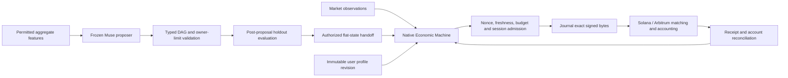

# Agent-native perpetual markets

Economic Machine compiles bounded strategy policies into native decisions. These
adapters connect that runtime to two orderbooks with chain-specific accounting.
The model proposes policies; the native runtime reacts to market events; the
chain checks authority, matches orders and settles collateral.

| Source | Status | Main boundary |
| --- | --- | --- |
| [Solana v6](solana/v6/) | Deployed and tested on devnet | Synthetic collateral and controlled demand |
| [Solana v7](solana/v7/) | Undeployed optimization candidate | New production layout requires a new market |
| [Arbitrum](arbitrum/) | Bounded Arbitrum One pilot settled | Small controlled USDC experiment |
| [Pinned runtime](runtime/include/) | Economic Machine C++ headers | Candidate decisions carry no signing authority |

The [research companion](https://github.com/skew-labs/economic-machine-research)
contains the working paper, methods, curated numerical tables and figures. It
separates implementation latency, chain execution cost and trading performance.
Source identities are recorded in [source-provenance.json](source-provenance.json).
Operator journals, credentials, server-specific launchers and generated binaries
are not shipped.

## Execution structure

The evaluated model was `meta/muse-spark-1.3-contributor`. Weight updates are not
part of the system. Generated output is bounded numeric DAG data, never arbitrary
code. There is no model call per tick. Model/provider consent and permitted data
projection are separate from trading-session authority; a policy result cannot
raise a user's limits or authorize a signature.

## Chain-specific choices

Solana uses fixed arenas, integer ticks/lots, bitmap price discovery, intrusive
FIFO, bounded visits and quote-frame replacement. A market has one shared writable
account; faster matching does not make that market parallel-writable. v6 supports
compact16 and wide256 layouts. v7 adds cumulative IOC fee rounding, cached
maker-risk geometry, batched native observation scanning and an external-price
initialization mode. v7 is not an in-place upgrade of the deployed v6 market.

Arbitrum uses packed commands/accounts, bounded FIFO traversal, a global solvency
index and atomic multi-account quote replacement. Its C++ coordinator emits
calldata for independent owner scopes. Fee comparisons must distinguish EVM
execution from Nitro posting cost. Unknown submissions retain reservations until
their receipts, nonces and account effects are reconciled.

## Verification and use

See the version-specific guides for offline builds and tests. They do not open a
funded run. Development clients retain devnet cluster guards; Arbitrum's quote
service requires an immutable mandate and an external signer socket. Neither is
a ready-made public exchange operator.

Published Rust/Solidity programs and pinned runtime headers are byte-for-byte
copies of the measured snapshots. C++ arithmetic is unchanged; one Arbitrum include
path points at the shared runtime. Packaging also replaces private filesystem
defaults and supplies curated numeric test fixtures. Existing deployment keys,
session files and model-call archives are not dependencies of the public tests.
Historical measurements identify their exact version and are not measurements
of a new deployment made by publishing this repository.

## Accounting boundaries

The Solana v6 insurance resolution is a terminal market-wide haircut of positive
claims when insurance is insufficient. It is not risk-ranked pairwise ADL. The
Arbitrum implementation blocks withdrawals while latent market insolvency remains;
external recapitalization is required beyond insurance, and uninvolved flat
depositors can be affected by that halt. Neither behavior is hidden as trading
alpha. In a closed test, participant price/funding transfers plus exchange fees
must balance; outside gas costs are reported separately.

Public-network capacity, independent customers, external profitability and
production backstop availability remain separate questions. The research paper
reports both losses and successful technical checks.
