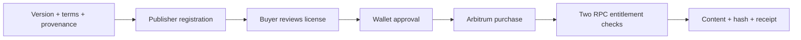

# DataPass

Publish an immutable data version and sell access to it. The license binds report, terms and
provenance roots; delivery checks the current wallet's entitlement and expiry.

[Open DataPass](https://skew.deals/commerce/data-pass.html)

| Area | Source |
| --- | --- |
| ERC-721 access license, purchase and resale | [SkewDataPass.sol](../../contracts/SkewDataPass.sol) |
| Chain reads, unsigned plans, immutable versions | [datapass.py](../../src/machine_commerce/datapass.py) |
| Verified work → publication | [work_artifacts.py](../../src/machine_commerce/work_artifacts.py) |
| Adversarial / integration tests | [contract tests](../../tests/test_datapass_contract.py), [reader tests](../../tests/test_datapass_reader.py) |

The reader verifies configured bytecode and finalized state. Deployment and registration drafts
remain unsigned until the owner acts. A token does not prove legal ownership of upstream data;
publishers must hold the sale rights. DataPass contract purchases and x402 payments are separate
rails. Never charge one sale through both. Track payment and off-chain delivery separately.
