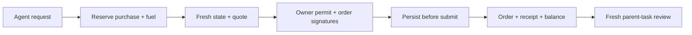

# Swap / Fuel

Acquire native ETH on Arbitrum One with a reviewed USDC swap, then track the exact order
until settlement is independently reconciled. The agent proposes; the owner signs.

[Open console](https://skew.deals/commerce/console#overview) · [API and boundaries](../../docs/FUEL.md)

| Area | Source |
| --- | --- |
| Quotes, exact signed orders, submission | [gas_router.py](../../src/machine_commerce/gas_router.py) |
| Fresh chain / price checks | [fuel_rpc.py](../../src/machine_commerce/fuel_rpc.py), [fuel_price.py](../../src/machine_commerce/fuel_price.py) |
| Durable status / finalized settlement | [swap_tracking.py](../../src/machine_commerce/swap_tracking.py) |
| Shared engine budgets | [fuel.py](../../src/machine_engine/fuel.py) |
| Owner wallet client | [swap-wallet.js](../../web/swap-wallet.js) |
| HTTP service | [gas_portal.py](../../src/machine_commerce/gas_portal.py) |

Start with the [self-hosted Engine](../../docs/SELF_HOSTING.md), configure a wallet connection
and an owner-defined Fuel policy, then use `/api/engine/fuel/requests` as documented.
Source alone does not provision an external solver or sponsor.

Supported assets are native USDC and native ETH on chain 42161. A solver can pay settlement gas
and recover it in the quote; that does not make every route gas-free. Native-transaction paths
still need an upfront gas payer. Unknown orders are reconciled rather than blindly retried.
